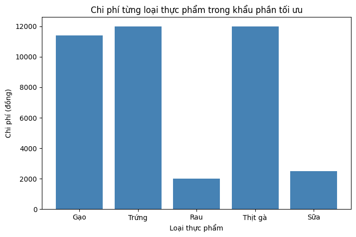

# Tối ưu hóa chi phí chế độ ăn (Diet Cost Optimization)

## Giới thiệu
Đây là bài toán Quy hoạch tuyến tính (Linear Programming) nhằm tìm lượng thực phẩm 
tối ưu sao cho **tổng chi phí thấp nhất**, trong khi vẫn đảm bảo đủ nhu cầu dinh 
dưỡng tối thiểu hàng ngày (calo, đạm) và duy trì sự đa dạng thực phẩm.

## Bài toán
- **Biến quyết định:** số lượng đơn vị (100g) của từng loại thực phẩm cần mua mỗi ngày
- **Hàm mục tiêu:** tối thiểu hóa tổng chi phí
- **Thực phẩm xem xét:** Gạo, Trứng, Rau, Thịt gà, Sữa
- **Ràng buộc:**
  - Đảm bảo tối thiểu 2000 calo/ngày
  - Đảm bảo tối thiểu 50g đạm/ngày
  - Đảm bảo mức tối thiểu riêng cho từng loại thực phẩm (đa dạng dinh dưỡng)

## Công cụ sử dụng
- Python
- PuLP (giải bài toán Quy hoạch tuyến tính)
- Matplotlib (trực quan hóa kết quả)

## Cách triển khai
Dữ liệu thực phẩm và yêu cầu dinh dưỡng được lưu dưới dạng dictionary, sau đó dùng 
vòng lặp và `pulp.lpSum` để tự động tạo biến và ràng buộc — cho phép mở rộng thêm 
thực phẩm/dinh dưỡng mới mà không cần viết lại cấu trúc code.

## Kết quả
Với bộ dữ liệu giá cả và dinh dưỡng đầu vào, mô hình tìm ra khẩu phần tối ưu với 
**tổng chi phí 39.883đ/ngày**. Biểu đồ dưới đây thể hiện cơ cấu chi phí theo từng 
loại thực phẩm:

## Ý nghĩa thực tế
Mô hình này minh họa cách ứng dụng Quy hoạch tuyến tính vào bài toán tối ưu hóa 
thực tế, có thể mở rộng cho các bài toán phức tạp hơn như: tối ưu chi phí nguyên 
liệu sản xuất, phân bổ nguồn lực, lập kế hoạch vận chuyển...

## Cách chạy
1. Cài đặt thư viện: `pip install pulp matplotlib`
2. Chạy file `diet_optimization.ipynb` trên Jupyter Notebook hoặc Google Colab
